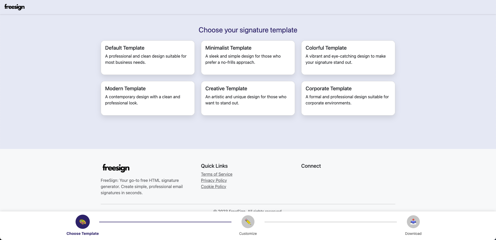
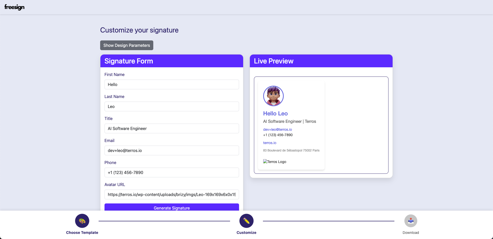
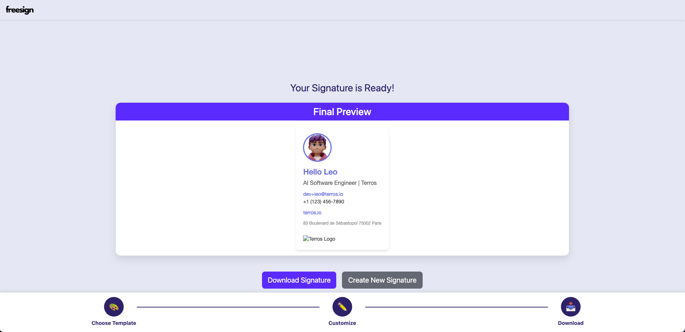

# HTML Email Signature Generator 📧✨

Welcome to the HTML Email Signature Generator! This tool helps you create professional and personalized email signatures with ease. 🚀

## Features 🌟

- 📝 Customizable templates
- 🎨 Easy-to-use web interface
- 🔧 Flexible and adaptable
- 💼 Perfect for businesses and individuals

## Preview 👀

Here's a sneak peek of what our Email Signature Generator looks like:





## How to Use 🔍

1. Clone this repository 📂
2. Make the install script executable:
   ```
   chmod +x install_and_run.sh
   ```
3. Run the install and launch script:
   ```
   ./install_and_run.sh
   ```
5. Open the `index.html` file in a text editor
6. Find the `API_URL` variable near the top of the `<script>` section and set it to your server's URL:
   ```javascript
   const API_URL = 'http://your-server-url:5000'; // Replace with your actual server URL
   ```
7. Open `index.html` in your web browser
8. Choose a template and customize your email signature
9. Download the generated HTML file and add it to your email client ✉️

## Requirements 📋

- Unix-like operating system (Linux or macOS)
- Python 3.x 🐍
- pip (Python package installer)

## Contributing 🤝

We welcome contributions! Feel free to submit pull requests or open issues if you have any suggestions or improvements.

## License 📄

This project is open-source and available under the MIT License.

Happy emailing! 😊
